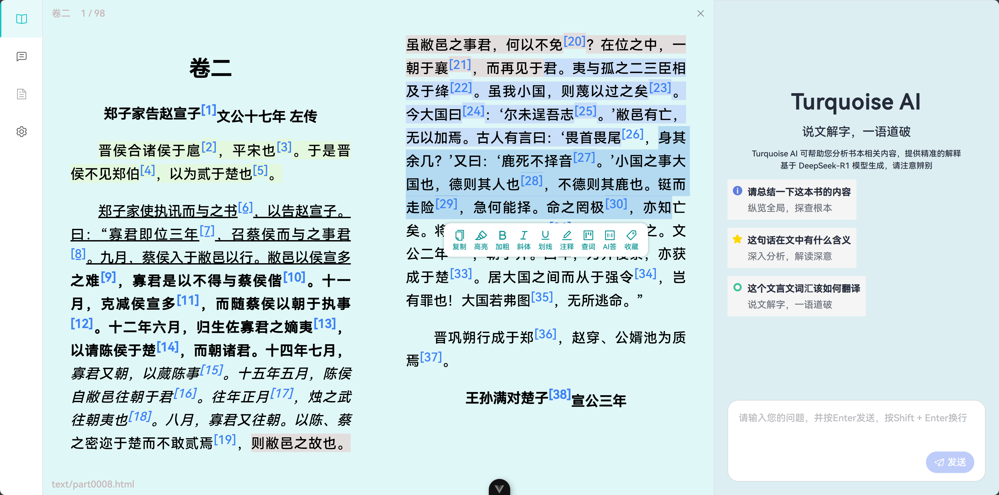

 

  
  <h2 align="center" style="color: #2ca7b7ff;">Turquoise</h3>
  

    一个本地EPUB阅读工具，提供丰富的辅助阅读功能
  

 

## 小说一句
本项目是一个本地运行的EPUB阅读工具。当然，这并非重点，主要是为了解决阅读文言文的困难，后续将开发丰富的辅助功能，例如可进行查词和AI翻译，更可以写注解或者译文，提高文言文的阅读效率（也是我原先项目ClassicTrans的升级版）  
以上皆为展望，项目刚刚起步  

## 使用技术栈
Vue3 ( 框架 ) + Vite ( 构建工具 ) + Element-Plus ( UI组件库 )

## 多阶任务
> 一阶（适）  
> 完成基础界面布局，写好可进入小说并预览的接口 （已完成）

> 二阶（难）  
> 专注 Reader 阅读器的制作，自定义样式，固定储存的预览方式  (已完成)

> 三阶（适）  
> 完成功能栏的制作，接入接口

> 四阶（易）  
> 修复BUG 美化界面 打包Webpack上线网页端（可能）

> 五阶（易）  
> 使用 Electron 封装桌面版 使用 Uniapp 封装移动端
## 开发日志
`2025.7.20` 创建了这个项目，决定使用 Element-Plus 作为UI组件库  
`2025.7.21` 使用 Splitter 分隔面板 进行页面布局 写了部分关于侧边栏的 UI   
`2025.7.22` 给 Aside 侧边栏添加了青色样式  
`2025.7.23` 往 Main Interface 写一丢丢东西，写了一点点样式，然后一直在搞关于存储和解析的东西，却始终没有运行起来，deepseek实在太过弱智，明天自己写吧  
`2025.7.24` 干了超多事情，把EPUB存储模块写在了`.src/epubStorage.ts` 使用 IndexedDB 作为数据库，然后写了一点关于 BookViewer 的样式和动画  
`2025.7.25` 修改了布局 采用 Menu + Splitter 解决了布局长久以来的问题。使用了 Space 间距多 BookViewer  EPUB渲染仍有问题  
`2025.7.26` 经过一天的反复捣鼓，看了一堆库，翻来覆去，终于在实践官方example文件后 给ds重新编写后 EPUB书本终于加载出来了 第一阶任务完成   
`2025.7.27` 重写Reader.vue文件，研究EpubJS ing... 使用 pinia 进行组件间数据传输，完成目录功能，写好目录跳转。紧急加更，当视窗大小发生改变就重新渲染  
`2025.7.28` 修复目录栏消失BUG 更改目录样式 更改Reader样式，使风格更加柔和  
`2025.7.29` 增加文章数据信息展示 完成选中右键位置自动计算和相关样式  
`2025.7.30` EpubCFI的BUG过多，我更改了增加注释的方式，直接操作DOM，完成高亮  
`2025.7.31` 完成大部分Turquoise AI的界面布局，接入API  
`2025.8.2` 搞了一天的python，解析了一下网页，做了关于查词的API  
`2025.8.9` 恢复更新，小小得更改了trans的样式  
`2025.8.13` 终于成功完成的储存注释，第二阶段任务正式完成  
`2025.8.20` 突破性进展，注释渲染和注释存储方面的BUG解决了部分，感谢deepseek  
`2025.8.21` 完善AIchat部分  
`2025.8.22` 添加导入模版功能，修复释义功能，重写Trans部分UI界面，新增阅读器设置的侧边栏
## 预览图
主界面
  
阅读界面
  

## 鸣谢
> Flow -https://app.flowoss.com/  
> 提供页面布局、样式思路

> 识典古籍 -https://www.shidianguji.com/  
>提供功能设计思路

> 硅基流动 - https://www.siliconflowcn.com/  
>提供免费的 DeepSeek-R1-0528-Qwen3-8B